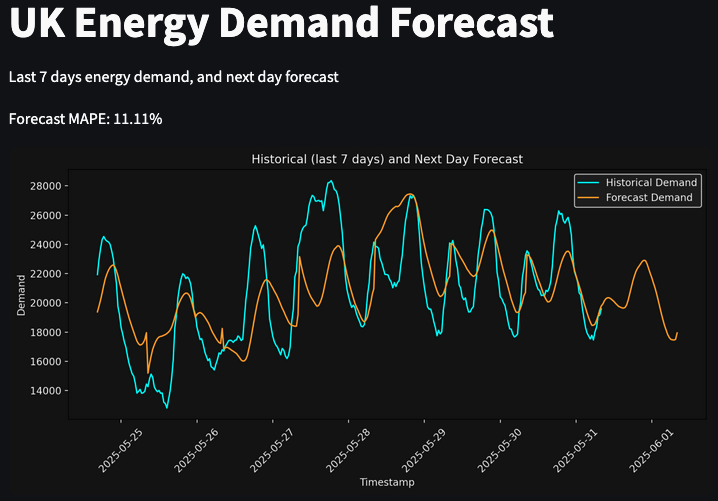

# UK Energy Demand Forecasting Live Service

This project demonstrates how to build and deploy a **live forecasting service** for UK energy demand using Azure and Streamlit.

**Author:** Ross Pietukhov  

## Overview

The service showcases an end-to-end pipeline for forecasting UK energy demand, featuring:

- A **ridge regression forecasting model** trained locally using NESO data.
- Model artefacts stored securely in **Azure Blob Storage**.
- Automated data ingestion and processing with **Azure Data Factory**, loading NESO data into Blob Storage.
- A daily **forecast generation pipeline** triggered in Azure that applies the saved model to produce next-day energy demand forecasts, saving results back to Blob Storage.
- A **Streamlit web app frontend** that visualises both historical energy demand and forecasted values alongside a 7-day MAPE (Mean Absolute Percentage Error) metric for accuracy assessment.

## Components

### 1. Forecasting Model  
- Built locally using ridge regression on NESO data.  
- Serialised and saved as a pickle file in Azure Blob Storage for production use.

### 2. Data Pipeline  
- Azure Data Factory orchestrates data loading of NESO demand data into Blob Storage.  
- Azure Function process uses the model to generate next-day forecasts.

### 3. Streamlit Frontend  
- Reads historical and forecast data from Blob Storage.  
- Displays interactive charts of historical demand vs. forecast demand.  
- Calculates and shows forecast accuracy using MAPE for the last 7 days.
- Deployed using Azure Web Service

## Technologies

- Python
- Streamlit
- Azure (Blob Storage, Data Factory, Functions, Web Service)

## Future Improvements
This project currently serves as a demo with a straightforward forecasting approach and basic features. However, the solution can be significantly enhanced and tailored based on user requirements. Some potential improvements include:

- Incorporate additional data sources and features to enhance forecasting accuracy, such as weather conditions, public holiday calendars, and economic indicators.
- Expand the historical dataset used for model training to improve robustness and capture longer-term trends.
- Experiment with multiple forecasting models including Random Forest, XGBoost, and LSTM neural networks to compare performance and potentially combine predictions.
- Implement automatic model retraining pipelines triggered by performance degradation or new data availability to maintain model accuracy over time.
- Enhance the front end with richer interactivity, real-time updates, and improved visualisations for better user experience.
- Integrate deployment monitoring and logging for easier maintenance and troubleshooting.

## Licence

This project is licensed under the MIT Licence. See the [LICENSE](LICENSE) file for details.

## Contributing

Feel free to open issues or contribute via pull requests!  
Your feedback and help are very welcome.
